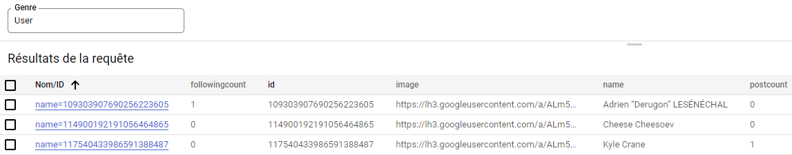
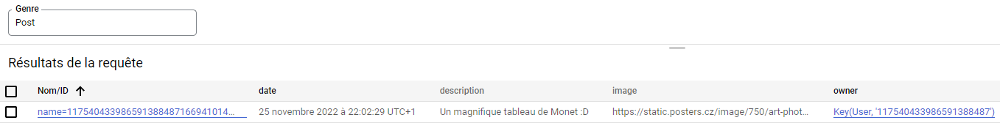
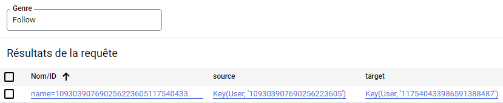
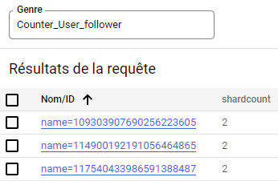
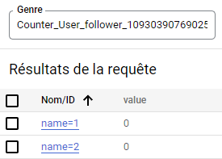
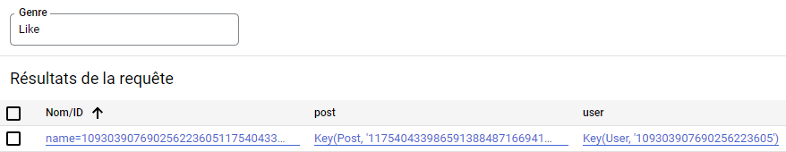
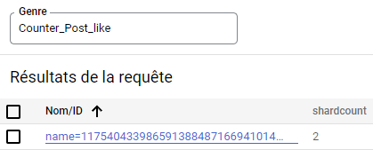
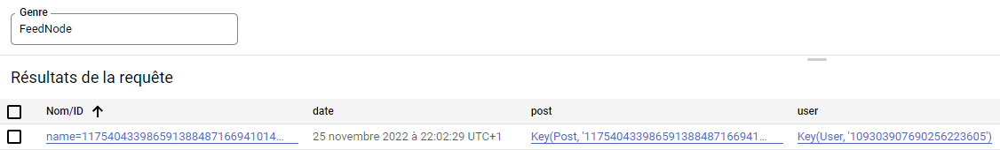

# Tinygram

*_Application deployment:_ [`https://tinygram-369720.nw.r.appspot.com`](https://tinygram-369720.nw.r.appspot.com)*

## Front-End

Made with VueJS, Vuex and Tailwind CSS, the front-end was designed to be responsive and user friendly as much as we could in the given period of time. It will help a user find every functionality he needs to communicate with his friends. 

Here as the differents paths you can use to access the web app:

- `/` *Home page, where you can discover new users and the posts from people you are following.*
- `/login` *The login page to access the web app you will need to be authenticated with your Google Account*
- `/users/{userId}` *Access the profile of a given user*
- `/posts/{postId}` *Access and display a given post*
- `/not-found` *self-explanatory (404 Errors)*
- `/addpost` *self-explanatory (Post a new post)*

What's' the store used for ?

The store is used as a single source of reliable information that we need but also mainly to manage user related informations across the different components. Mostly the user authentication token and some user data needed during the time the user will spend on the application.

## Back-End

The general back-end problem has been split into two distinct problems, with each its own package:

- [`tinygram.api`](src/main/java/tinygram/api): Managing the resource availability with the public REST API;
- [`tinygram.datastore`](src/main/java/tinygram/datastore): Managing the resource availability with the public REST API.

After several refactorings, we went through different data representations and chose to distinguish the data seen from the front-end, manageable using the API, which we call *resources*, and the data stored internally within the datastore, which we call entities. *E.g.*, assuming an API request has been made to update information about a specific user:

- A PUT request was made, redirecting to the user-specific API, as defined within the user API schema ([`tinygram.api.UserApiSchema`](src/main/java/tinygram/api/UserApiSchema.java)).
- The request itself is handled by the API method implementation, which runs the actual datastore transaction ([`tinygram.api.UserApi`](src/main/java/tinygram/api/UserApi.java)).
- The user data provided within the request body is then deserialized into a user resource updater ([`tinygram.api.LoggedUserUpdater`](src/main/java/tinygram/api/LoggedUserUpdater.java)).
- During the transaction, a specific interface is used to interact with user datastore entities ([`tinygram.datastore.UserEntityManager`](src/main/java/tinygram/datastore/UserEntityManager.java)).
- User data is then fetched from the datastore using this interface, which provides a type-safe wrapper instead of the raw entity ([`tinygram.datastore.UserEntity`](src/main/java/tinygram/datastore/UserEntity.java)).
- The fetched entity can now be updated by the API, giving it to the initial user entity updater.
- After the transaction has been committed, a user resource is built as an aggregate of the user entity and its associated follow/counter entities ([`tinygram.api.UserResource`](src/main/java/tinygram/api/UserResource.java)).
- When trying to produce the JSON response to the HTTP request, Google's API management instanciates a user resource transformer ([`tinygram.api.UserTransformer`](src/main/java/tinygram/api/UserTransformer.java)).
- By giving it the previously created user resource, the transformer formats it into a JSON-serializable response object, which is given back to the client ([`tinygram.api.UserResponse`](src/main/java/tinygram/api/UserResponse.java)).

### Entity kinds

Within the datastore, post and user data has been split into different entities, to either help reaching a scalable system, or improve overall performance.

User personal data is directly stored within a *User* entity, the same goes for a *Post*.

When user *A* follows user *B*, the corresponding information is stored in multiple entities:

- as an increment of the `followingcount` property of user *A*,
- as a tuple entity *Follow*(*A*, *B*), and

- as an increment of the follower counter of user *B*. This counter is split into multiple shards, with each counter its own shard kind.

The same goes for a like from user *A* to post *P*, which is stored:

- as a tuple entity *Like*(*A*, *P*) and

- as an increment of the (also sharded) like counter of user *B*.

Finally, when a post *P* is created by user *B*, it is added to the post feed of all followers *F* of *B*. This relation is also represented as a set of tuples *FeedNode*(*F*, *P*).

## Small Benchmark

We started by evaluating the time elapsed when posting a message if followed by 10, 100, and 500 followers. (30 measures each)

To perform the benchmark without having to create 10 to 500 accounts we added in our API methods to create fake entities. 
These fake entities are stored and are processed by the back-end API as a real follower. Allowing us to test our code like it 
was already in production.

API Route: `API_URL/benchmark/followers/100` 

*(Add or remove fake followers to reach the number of followers passed as argument here 100)*

**More detailed results with the 30 measures are available in `./assets/benchmark.xlsx`**

|              | 10    | 100     |   500   |
|--------------|-------|---------|---------|
| front-end    | 329ms | 1245ms  | 5421ms  |
| back-end     | 294ms | 1202ms  | 5388ms  |
| mean         | 311ms | 1224ms  | 5405ms  |

Then we evaluated the time required to load 10, 100 and 500 posts at the same time via the API. 
We decided to load posts 6 by 6 when a user is scrolling. It should be fine for the user experience.
A user wont be able to load and see more than 6 posts at the same time. So he should not expect any latency.
However for the benchmark it increases the time required to retrieve the 10, 100, 500 posts.

API Route: `API_URL/benchmark/publisher/100` create a fake user, automatically follow him and create X fake posts
for the benchmark. (X values in our case: 10, 100, 500)

|              | 10    | 100     |   500   |
|--------------|-------|---------|---------|
| mean         | 227ms | 1734ms  | 7024ms  |

We decided to not do the 3rd benchmark because in order for us to do a simulation of how many like we can do at the same time, we need to add as many users that have connected correctly with google, which means creating too many google accounts and users just for this test.

Our design does not allow us to like a post without being connected as we need the user key generated on the first user login. This key is used in the datastore to keep a record of who liked the post.
Even if we decide to deactivate the authentication, and fake a user key the links between some entities will not work properly and we may end up having wrong results for the tests.

To perform that change we need to redo our entire model and make alot of changes.

## Legacy

A short list of things we planned to do, but could not implement of finish designing with the given project timeline. Thanks to the additional project week, we managed to implement some improvements initially in this list, especially the logarithmic counter allocation and the introduction of a type-safe interface for entity properties ([`tinygram.datastore.Property`](src/main/java/tinygram/datastore/Property.java)).

- Improve API resource updaters with use of JSON serializers (`com.google.api.server.spi.config.Transformer`) to hide public fields, and maybe find another solution to run transactions from APIs and not from resource updaters.
- Improve the datastore interface to manage parallel entity updates, i.e. allow multiple entities to update the same one within the same transaction. Maybe replace all TypedEntity instances with, for each one:
    - an `EntityView` with read-only operations and
    - an `EntityUpdater` with write-only operations, using delayed transaction operations with more functional interfaces.
- Consider using entity groups to improve performance, mainly with counters and Like/Follow entities.
- Find a way to make the benchmark API require specific identifiers, to prevent any logged-in user from using it.
